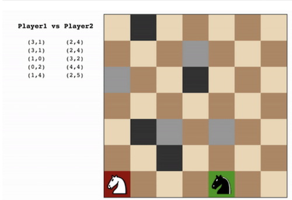

# Running `python tournament.py`

```
Match #   Opponent    AB_Improved   AB_Custom   AB_Custom_2  AB_Custom_3
                       Won | Lost   Won | Lost   Won | Lost   Won | Lost
   1       Random       7  |   3     9  |   1     8  |   2     8  |   2
   2       MM_Open      6  |   4     8  |   2     8  |   2     8  |   2
   3      MM_Center     5  |   5     7  |   3     8  |   2     7  |   3
   4     MM_Improved    6  |   4     6  |   4     5  |   5     6  |   4
   5       AB_Open      4  |   6     4  |   6     6  |   4     5  |   5
   6      AB_Center     4  |   6     7  |   3     4  |   6     5  |   5
   7     AB_Improved    4  |   6     5  |   5     6  |   4     5  |   5
--------------------------------------------------------------------------
          Win Rate:      51.4%        65.7%        64.3%        62.9%
```

My custom score methods all slightly outperformed `AB_Improved`.

# Heuristic 1: Avoid walls and corners

Looking at the example gif, it seemed that a good strategy would be to avoid the walls and corners, because those positions limit the number of moves and as a result they'd likely be the end game scenario.



So I modified `improved_score` to subtract `percent_completed * square_distance` from it, where `percent_completed` is (# of moves made by you and the opponent / total number of squares)t, and `square_distance` is the square of the distance from the current position to the center.

# Heuristic 2: Chase first, run away later

I modified `improved_score` such that initially, it tries to "chase" the opponent by aggressively reducing the number of opponent's moves. And later, it tries to care less about the opponent and more about your own survival, by trying to maximize the number of moves you have.

This is done by multiplying `percent_completed` (same as heuristic 1) with the number of moves you have, and `1 - percent_completed` (same as heuristic 2) with the number of moves opponent have.

# Heuristic 3: Block opponent

I modified `improved_score` to favor positions that block one of the opponent's possible moves. This is done by adding to `improved_score` the `bias`, where `bias` is 2 (a small value that seems to work well) if you're in a position that blocks one of the opponent's possible moves, 0 otherwise.

# Re-submission Revisions

> **Feedback from the reviewer:** The report should verbally describe the performance of agents along with speculation as to why you think they performed better or worse than others.

Heuristic 1 (Avoid walls and corners), Heuristic 2 (Chase first, run away later), and Heurstic 3 (Block opponent) all performed much better than AB_Improved, winning at least 10% more. However, the differences between each custom heuristic was small.

All of custom heuristics played almost evenly against AB_Improved and MM_Improved, likely because all my custom heuristics are based on `improved_score`. However, for weaker opponents, such as Random, MM_Open, and MM_Center, my custom heuristics did much better compared to AB_Improved. This is likely because Heuristic 1 (Avoid walls and corners) tries very hard not to lose, and Heuristic 2 and 3 (Chase first, run away later, Block opponent) attacks very aggressively, and such strategy might be more effective in beating weak opponents than simple `improved_score`, which might not be defensive/aggressive enough.

> **Feedback from the reviewer:** You must make a recommendation about which evaluation function should be used with at least three reasons supported by the data. You may consider the win rate, its complexity, how the heuristic predicts the final outcome of the game, how deep it traverses the game tree, etc.

I they ould recommend Heuristic 1 ("Avoid walls and corners"). First, its win rate was the best compared to other agents from my trial. Second, all of the required data can be computed as quickly as that of `improved_score` - the heuristic requires % of game completed (can be retrieved in O(1) based on game count), # of own/opponent moves (requires the same amount of time as `improved_score`), and the player's distance from the center (can be computed in O(1)). Finally, the heuristic seems reasonable given how the game works - when you're near the wall or a corner, compared to when you're near the center, you're more likely to be near the wall or a corner again after 2~3 moves. Since the number of moves you'll have is lower when you're near the corners, the heuristic can essentially predict the number of moves you'll have 2~3 moves deeper without actually traversing the game tree, which is definitely a plus.

Heuristic 2 and 3 perform almost as well in terms of win rate, and calculation is much simpler, but the performance savings is O(1) and therefore not much better.
